# Pokemon desde JSON Server

**Autor:**

- Kevin Johan Jimenez Delgado

## Pasos para la correcta instalación de node usando Windows

- En primer lugar se debe saber si se tiene instalado node, colocando la siguiente instrucción en el terminal de la computadora o visual studio code `node --version`, en caso de que salga error o salga una versión menos que la "18.18.0", se hace lo siguiente:

- Si se tiene un node menor al recomendado, se recomienda desinstalarlo desde el panel de control->Desinstalar un programa-> Desintalar node; luego para instalar la ultima versión se debe ir a la página de node e instalar la versión que se desea usar `https://nodejs.org/es/download`, obviamente que sea "18.18.0"

## Pasos para la correcta instalación de node usando Linux

- En primer lugar se debe saber si se tiene instalado node, colocando la siguiente instrucción en el terminal de la computadora o visual studio code `node --version`, en caso de que salga error o salga una versión menos que la "18.18.0", se coloca la siguiente instrucción para instalar node en una versión correcta de funcionamiento `nvm install 18.18.0`, luego en visual studio code, en el fichero donde se vaya a trabajar, se va a la terminal y se coloca `npm i`

## Primera configuración en Node para tu proyecto

- Colocar la siguiente instrucción para introducir node en la ruta donde vas a trabajar, `npm init -y`  
- Luego en la consola saldrá lo siguiente, muy parecido pero no saldrá igual, igual este se vera en un archivo llamado "package.json" en tu fichero
```
{
  "name": "presupuestocasaennode",
  "version": "1.0.0",
  "description": "**Autor:**",
  "main": "main.js",
  "scripts": {
    "test": "echo \"Error: no test specified\" && exit 1"
  },
  "keywords": [],
  "author": "",
  "license": "ISC"
}
```
Edita los campos en la parte de autor por tu nombre y asegurate que tengas el AUTOGUARDADO, adicional agrega una linea, la del type, entonces se debería ver el archivo "package.json" de la siguiente forma. 
```
{
  "name": "presupuestocasaennode",
  "version": "1.0.0",
  "description": "**Autor:**",
  "main": "main.js",
  "type": "module",
  "scripts": {
    "test": "echo \"Error: no test specified\" && exit 1"
  },
  "keywords": [],
  "author": "Kevin JJ",
  "license": "ISC"
}
```

- Coloca la siguiente instrucción para ya añadir node a tu fichero local `npm -E -D install json-server`, ahí empieza una instalación y esta instrucción es para hacer una versión estable (NOTA: NO tocar las carpetas de node.modules ni "package-lock.son" que se crean): 

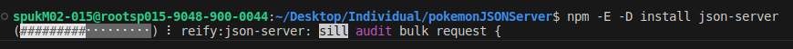

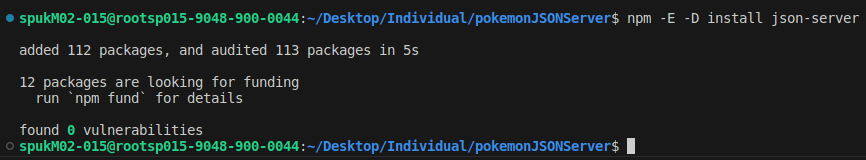

- Crear un archivo en el fichero llamado "db.json", con la siguiente linea de código como forma de prueba:
```
 {
  "pokemonesPokeApi":["Esto"],
  "pokemonesJSONServer":["Es"],
  "pokemones":["Prueba"]  
}
```
como notaras en el archivo "package.json", este ha cambiado, le vamos a editar la parte de scripts y dejarlo parecido a este:
```
{
  "name": "presupuestocasaennode",
  "version": "1.0.0",
  "description": "**Autor:**",
  "main": "main.js",
  "type": "module",
  "scripts": {
    "dev": "json-server --watch db.json"
  },
  "keywords": [],
  "author": "Kevin JJ",
  "license": "ISC",
  "devDependencies": {
    "json-server": "0.17.3"
  }
}
```
Por ultimo colocar la siguiente línea de comando `npm run dev`, y debería verse lo de que aparece en db.json, en la parte de resources aparece un link que al final aparece pokemonesPokeApi, pokemonesJSONServer, pokemones y lo que se edite en vivo con el "db.json" se podrá evidenciar en esos links. Para salir del en vivo con CTRL+C en la terminal

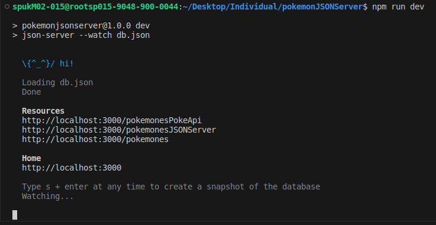

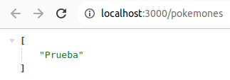

- Con npm corriendo, podemos usar node en otra terminal y colocar el comando `node main.js` para ver los resultados en consola desde Visual Studio Code y desde ahí poder trabajar

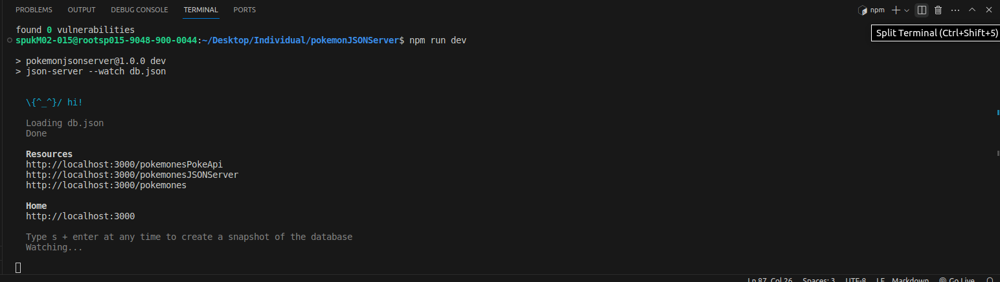

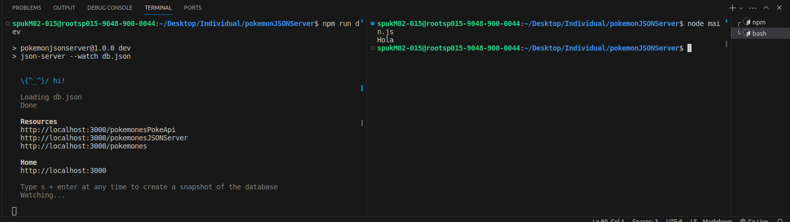

## Ignorar algunos archivos antes de subir al git

- Antes de subir al repositorio y para evitar conflictos, en la carpeta donde se esta trabajando se debe crear un archivo `.gitignore` y dentro de él colocar las carpetas que no desean que se suban al git para evitar conflictos, obligatoriamente deben estar las que se muestran a continuación:

```
node_modules
package-lock.json
```

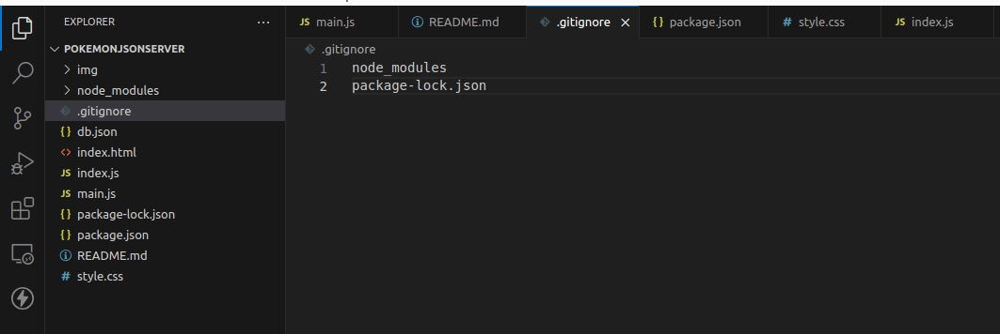

- Con esto ya se puede subir todo al GitHub

## Clonar desde el repositorio

- Si se desea trabajar el proyecto, se debe clonar obviamente donde se desea trabajar o fichero deseado, en la terminal de Visual Studio Code con `git clone <url>` y luego de eso invocar el siguiente comando `npm i` en el lugar donde el fichero descargo todo de GitHub. Ya con eso se puede invocar el comando `npm run dev` para trabajar desde el repositorio clonado.

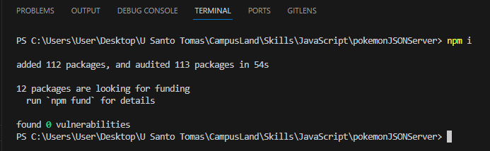

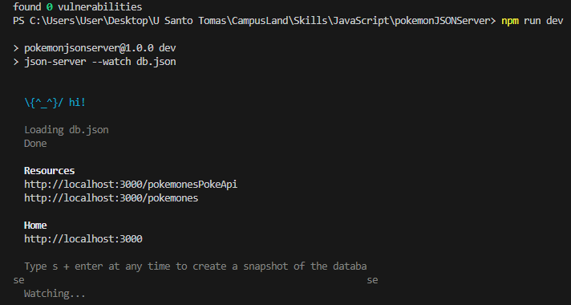


## Descripción del Proyecto

Este proyecto interactua con una api `https://pokeapi.co/`, en el cual los primeros 10 pokemones con su id me los envía a un JSON SERVER local `http://localhost:3000/pokemonesPokeApi` para que se pueda interactuar con ellos, el proyecto me permite ver en consola los pokemones existentes en la mockapi, ver una vista previa de como se verán los pokemones existentes, buscar un pokemon y si lo encuentra dejarme editar los datos, y por último eliminar pokemones por nombre.

## Tecnologías Utilizadas

- HTML
- CSS
- JavaScript
- Interactuar con APIs, PokeApi, JSON Server y sweetalert2 `https://sweetalert2.github.io/`
- Métodos como PUSH, DELETE, POST
- Eventos de escucha como addEventListener

## Instrucciones de Uso

1. Abre el archivo `index.html` en tu navegador para visualizar el proyecto, se verá de la siguiente forma:


2. Para realizar acciones en la api, se utiliza las siguientes funcionalidades, de acuerdo a los nombres de los botones:

   - **pokeapiMockapi:** Como los nombres de los pokemones se pueden obtener de acuerdo al siguiente link  `https://pokeapi.co/api/v2/pokemon/ditto` siendo ditto un numero empezando desde 1, lo que hace este botón es primero extraer los datos de los 10 primeros pokemones encontrados en la api (junto con su id, name, hp, attack, defense, specialAttack, specialDefense y speed) y luego enviarlos al JSON Server `http://localhost:3000/pokemonesPokeApi` para posteriormente ser editados. Por defecto aparece desabilitado porque solo me interesa que se envíen estos datos una sola vez

   - **Pokemones existentes JSON Server:** Como se va a pedir prácticamente los nombres de los pokemones para hacer varias operaciones, este botón me muestra en consola los pokemones existentes en mockapi, para que el usuario sepa con cuales puede interactuar

   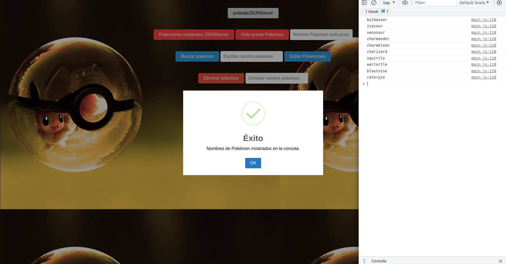

   - **Vista previa pokemon** Este botón muestra por defecto como se vería el pokemon si uno ingresa su nombre respectivo en la sección de "Nombre Pokemon vista previa" (imagen, name, hp, attack, defense, specialAttack, specialDefense y speed). Si encuentra el pokemon me muestra una vista previa del pokemon seleccionado desde el JSON Server, en caso de que no, me dice que no se encuentra en la base de datos.

   

   

   - **Buscar pokemon:** Lo primero que se debe hacer es escribir el nombre del pokemon que se desea editar en el apartado "Escribe nombre pokemon", si no se encuentra en JSON Server, me envía un mensaje diciendo que no se encuentra en la base de datos y sigue desabilitado el botón de "Editar Pokemones", pero si el nombre si se encuentra, se me habilita el botón de "Editar Pokemones"

   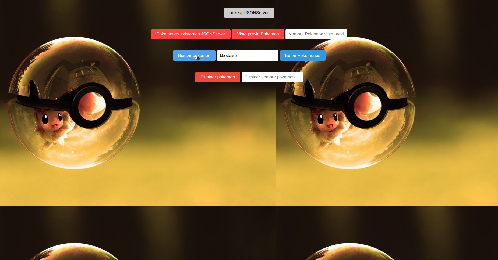

   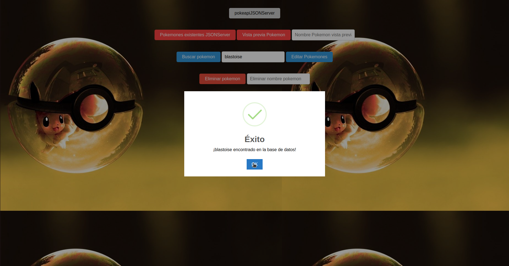

   

   - **Editar Pokemones:** Este se habilita cuando se encuentra el nombre ingresado por el usuario en JSON Server, de ahí el usuario puede mover sus datos a su elección para editarlos (hp, attack, defense, specialAttack, specialDefense y speed) y darle en el botón "enviar", al hacer esto, el botón "Editar Pokemones" se vuelve a desabilitar

   - **enviar:** Este solo aparece cuando ya se encuentra en el apartado de editar, y es para enviar los nuevos datos a JSON Server para editarlos

   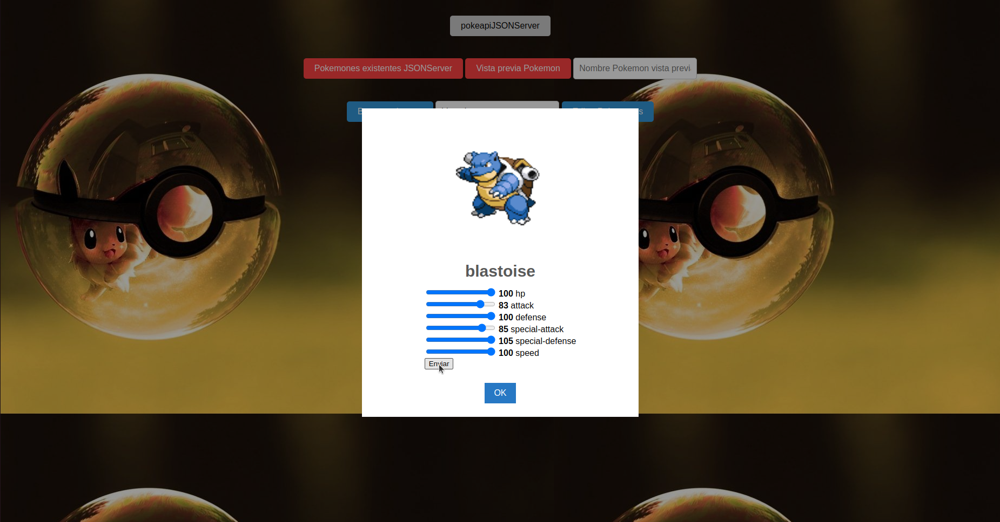

   Si por ejemplo visualizamos la vista previa del pokemon, notaremos que los datos se han actualizado

   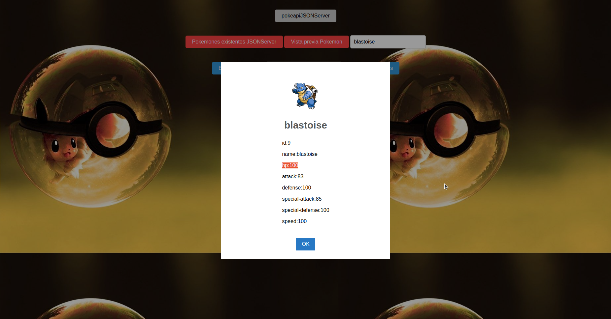


   - **Eliminar pokemon:** Lo primero que se debe hacer es escribir el nombre del pokemon que se desea eliminar en el apartado "Eliminar nombre pokemon", si no se encuentra en JSON Server, me envía un mensaje diciendo que no se encuentra en la base de datos, pero si el nombre si se encuentra, me lo elimina del mockapi

   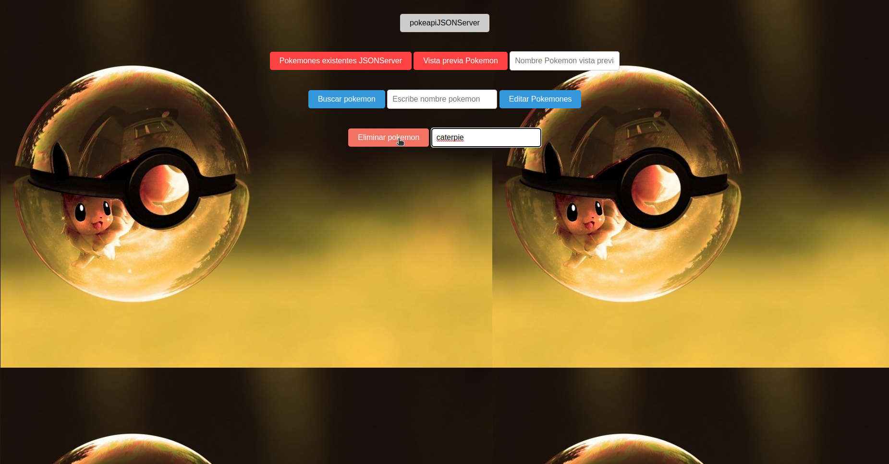

   Si por ejemplo visualizamos los nombres de los pokemones en consola, vera que ya no aparece el pokemon seleccionado

   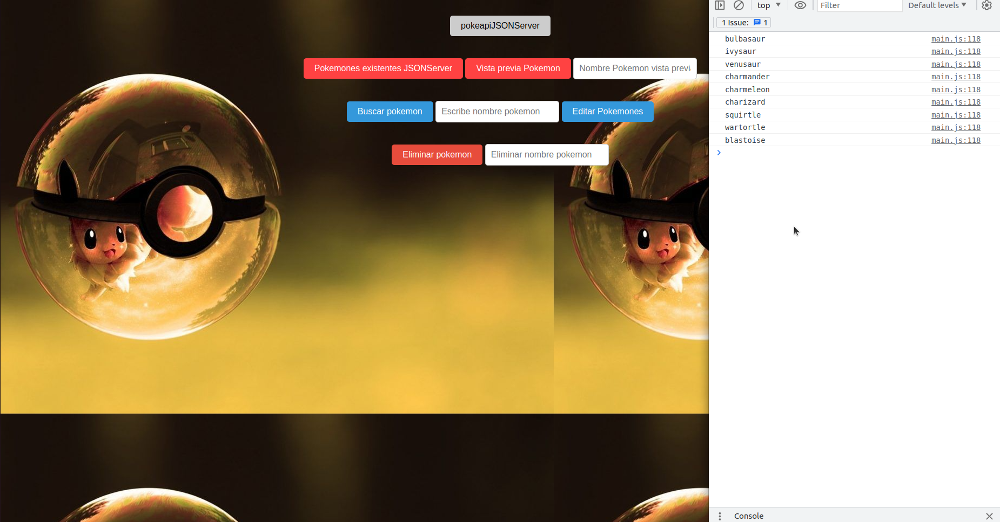

## NOTA

- **Ver proyecto:** Abrir con ver en vivo u open with live server

- **Actualizar Pagina:** Se recomienda que la primera vez que se abra la página, se vuelva a actualizar y de ahí ya se puede interactuar

